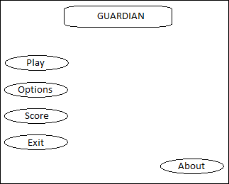
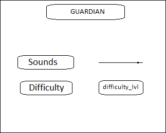
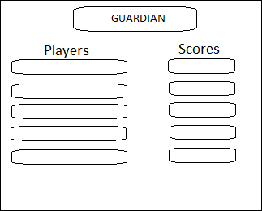

# Требования к проекту

# 1 Введение
Данное приложение будет представлять собой 2D платформер под названием “Страж”. Платформер - жанр компьютерных игр, в которых основной чертой игрового процесса является поиск предметов, обычно необходимых для завершения уровня.
# 2 Требования пользователя
## 2.1 Программные интерфейсы
Операционная система - Windows 10. Язык программирования - С#. Среда разработки – Unity3D. 
## 2.2 Интерфейс пользователя
Интерфейс приложения будет разделен на:
1.  Главное меню игры, где пользователь сможет зайти в настройки, зайти в окно топа игроков, найти информацию о разработчике, начать игру или выйти из самой игры:

2.  Меню настроек, где пользователь сможет изменить сложность игры и громкость:

3.  Просмотр топа игроков:

## 2.3 Характеристики пользователей
### 2.3.1 Классы пользователей
Приложение не разделяет пользователей на группы, предоставляя каждому одинаковый функционал. Единственное различие между игроками будет в скорости получения дополнительного контента.
### 2.3.2 Аудитория приложения
Целевой аудиторией может выступать люди любой возрастной категории, обладающие минимальной компьютерной грамотностью.

# 3 Системные требования
## 3.1 Функциональные требования
### 3.1.1 Основные функции
1.  Управление персонажем посредством клавиатуры и компьютерной мыши
2.  Сохранение прогресса при прохождении игры при помощи точек сохранения на карте
3.  Изменить уровень сложности
4.  Приобрести игровую валюту за реальные деньги
### 3.1.2 Ограничения и исключения
1.	Проверка на доступность всех файлов необходимых для запуска игры.
2.	Проверка на подмену файлов связанных с доступом к DLC.
3.	Проверка на корректность заполнения информации об игроке перед добавлением в таблицу рекордов.
## 3.2 Нефункциональные требования
### 3.2.1 Атрибуты качества
1.	При недостатке файлов пользователю будет выводится список недостающих или измененных файлов, которые необходимо заменить.
2.	Все функциональные элементы пользовательского интерфейса имеют названия, описывающие действие, которое произойдет при выборе элемента.
3.	При сохранении или неожиданном выходе из приложения все данные должны быть записаны в файл. При повторном запуске пользователь сможет продолжить с того же места.
